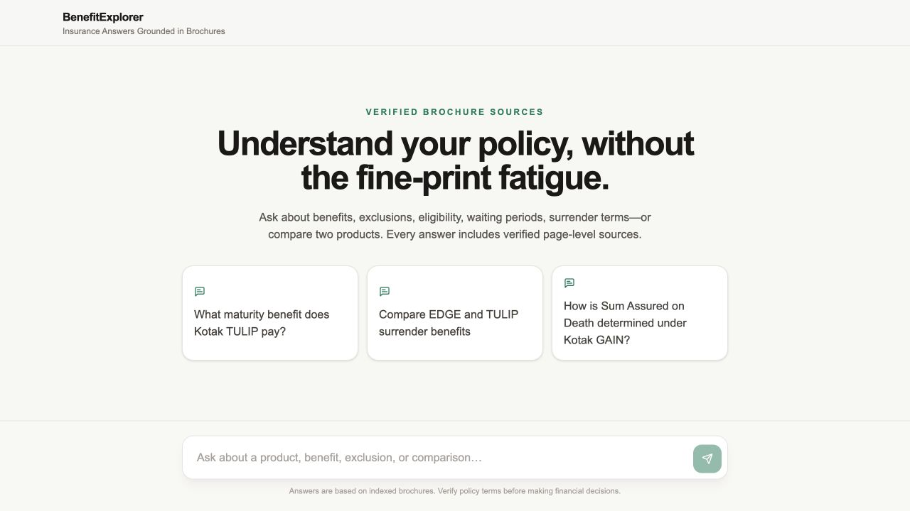
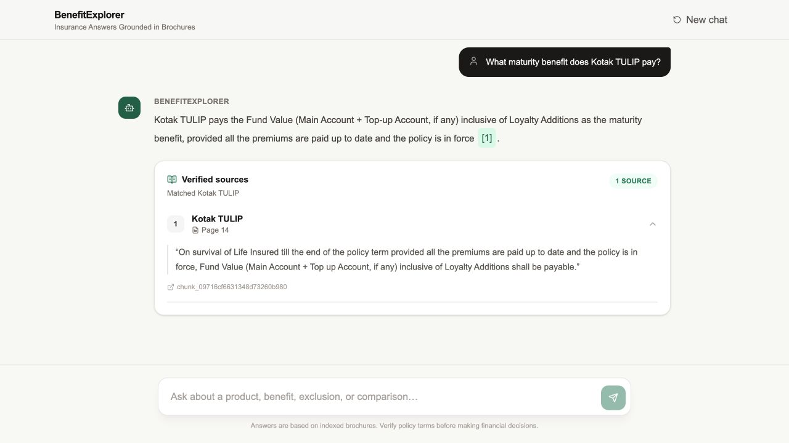
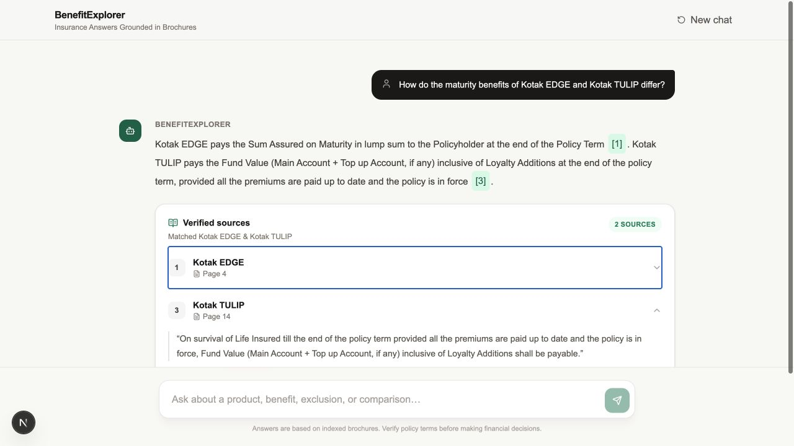
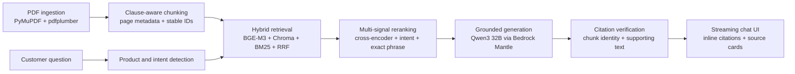

# BenefitExplorer

[](https://github.com/irishz12/Benefit-Explorer/actions/workflows/ci.yml?query=branch%3Amain)
[](LICENSE)
[](https://www.python.org/)
[](https://nextjs.org/)

> Insurance answers grounded in product brochures.

BenefitExplorer is a full-stack retrieval-augmented generation (RAG) system
that answers factual and comparative questions about insurance products. It
extracts evidence from PDF brochures, combines dense and lexical retrieval,
reranks the strongest passages, generates a grounded response, and verifies
inline citations before displaying the answer and sources.

This repository is a portfolio and research project. It is not financial,
insurance, or legal advice. Product terms must always be verified against the
latest official policy documents.

## UI preview

### 1. Fresh landing page



### 2. Simple product question

The following response was generated through the live FastAPI RAG pipeline. It
shows the inline citation, matched product, brochure page, supporting clause,
and stable chunk identifier rendered by the frontend.



### 3. Multi-product comparison

This larger query demonstrates product-balanced retrieval and separate cited
evidence for Kotak EDGE and Kotak TULIP.



## Problem statement

Insurance brochures are long, terminology-heavy, and difficult to compare.
Important details such as eligibility limits, waiting periods, exclusions,
surrender rules, and benefit calculations may be spread across multiple pages.
BenefitExplorer turns those documents into a searchable, citation-backed
knowledge assistant while preserving page-level provenance.

## Why this project

Insurance customers should not need to search dozens of brochure pages to
understand a benefit or compare two products. The difficult part is not simply
finding a matching paragraph: the system must preserve clause-level meaning,
balance evidence across products, and attach every major claim to verifiable
source text. BenefitExplorer demonstrates an end-to-end approach to that
grounding problem, from document ingestion through citation validation.

## Key features

- Page-aware PDF extraction with PyMuPDF and pdfplumber
- Clause- and section-aware chunking with stable chunk IDs
- BGE-M3 embeddings stored in persistent Chroma collections
- BM25 and dense retrieval fused with Reciprocal Rank Fusion (RRF)
- Product detection with hard filtering and score boosting
- BGE cross-encoder reranking with intent, section, exact-phrase, and focused-window signals
- Near-duplicate removal and dynamic final-context selection
- Product-balanced evidence selection for comparison questions
- Grounded Qwen3 32B generation through Amazon Bedrock Mantle
- Strict inline citation validation against retrieved brochure text
- Streaming FastAPI and Next.js chat experience with expandable source cards
- RAGAS evaluation with a manually labeled golden dataset

## Architecture overview



The production pipeline retrieves up to 40 candidates and dynamically selects
at most four final context chunks. Comparison queries reserve evidence for each
detected product. The generator receives full chunks so citations can be
validated and rendered with product and page metadata.

## Example questions and grounded answers

These examples are adapted from the manually labeled golden dataset. Citation
numbers represent the source cards returned by the application.

### 1. Income timing

**Question:** How soon can Kotak EDGE start paying me Guaranteed Income?

**Answer:** Guaranteed Income can start from the 13th policy monthiversary,
after the selected deferment period. The first payment requires the premium due
on the first policy anniversary to be paid and the policy to remain in force
[1].

**Source:** [1] Kotak EDGE, page 2 — `chunk_643b8e82237436dc72a94ff2`

### 2. Early liquidity restriction

**Question:** Can I get money out of Kotak TULIP during the first five policy
years?

**Answer:** Partial withdrawals are not available during the five-year lock-in
period [1]. A surrender request may be made during that period, but the
applicable discontinued-policy proceeds are paid only after the lock-in ends
[2].

**Sources:** [1] Kotak TULIP, page 27 — `chunk_b6101535d5e4025a10adbe58`;
[2] Kotak TULIP, page 30 — `chunk_a387fa0f7b1edb274e7ba324`.

### 3. Cross-product maturity comparison

**Question:** How do the maturity benefits of Kotak EDGE and Kotak TULIP differ?

**Answer:** Kotak EDGE pays the Sum Assured on Maturity plus any accumulated
Guaranteed Income under the accrual option [1]. Kotak TULIP instead pays the
Main Account and Top-Up Account Fund Value, including Loyalty Additions when
the policy is in force and all premiums are current [2].

**Sources:** [1] Kotak EDGE, page 6 — `chunk_592b0cfbc041bce3cad226c3`;
[2] Kotak TULIP, page 13 — `chunk_09716cf6631348d73260b980`.

## Tech stack

| Layer | Technology |
|---|---|
| PDF ingestion | PyMuPDF, pdfplumber, tiktoken |
| Embeddings | `BAAI/bge-m3`, Sentence Transformers |
| Sparse retrieval | BM25 |
| Vector database | Chroma |
| Rank fusion | Reciprocal Rank Fusion |
| Reranking | `BAAI/bge-reranker-v2-m3` |
| Generation | Qwen3 32B through Amazon Bedrock Mantle |
| Backend | Python, FastAPI, Pydantic, Uvicorn |
| Frontend | Next.js 16, React 19, TypeScript, Tailwind CSS, shadcn/ui primitives |
| Streaming | NDJSON through a server-side Next.js proxy |
| Evaluation | RAGAS judged by Qwen3 32B and GPT OSS 120B, plus deterministic Context Recall@4 |

## Evaluation results

The golden set holds 30 questions across six products, split into 20
development and 10 holdout questions that are reported separately. Generation
produced a citation-verifiable answer for 26 of the 30: 18 of 20 dev (Q032 and
Q036 failed) and 8 of 10 holdout (Q012 and Q031 failed). Every figure below
covers only the answered questions.

Answers come from `qwen.qwen3-32b`. Each one is scored twice, by
`qwen.qwen3-32b` as the self-judge and `openai.gpt-oss-120b` as the
independent judge, both on Amazon Bedrock Mantle. The runner rejects an
independent judge that shares the generator's model id or model family.

| Split | Metric | n | Self-judge | Independent judge | Self − independent |
|---|---|---:|---:|---:|---:|
| Dev | Faithfulness | 18 | 0.964 | 0.954 | +0.011 |
| Dev | Answer Correctness | 18 | 0.710 | 0.722 | −0.012 |
| Dev | Context Recall@4 | 18 | 0.972 | — | — |
| Holdout | Faithfulness | 8 | 0.912 | 0.804 | +0.109 |
| Holdout | Answer Correctness | 8 | 0.758 | 0.701 | +0.057 |
| Holdout | Context Recall@4 | 8 | 0.875 | — | — |

Context Recall@4 is deterministic and uses no judge. Both judges returned a
score for every answered question on both judged metrics, 104 of 104, so every
paired n equals the answered count.

At n = 8 the holdout is better read as counts: faithfulness is 1.000 on 6 of 8
questions for each judge, and all evidence groups are covered on 7 of 8. The
holdout faithfulness gap rests on two questions where the judges disagree,
Q003 and Q016.

Citation validation rejects cross-product comparisons disproportionately: 3 of
6 such questions produced no verifiable answer, against 1 of the other 24,
because a comparison must clear the verbatim-citation bar once per product.
The four excluded questions are therefore not a random sample of the set.

These figures describe this pipeline on this brochure set, not a general
benchmark.

## Supported brochure set

The golden dataset represents six products:

- Kotak EDGE
- Kotak TULIP
- Kotak Gen2Gen Protect
- Kotak Fortune Maximiser
- Kotak GAIN
- Kotak Assured Pension

Raw brochures and generated indexes are intentionally excluded from Git. Add
only documents that you have permission to use or redistribute.

## Data Source

The system was evaluated using publicly available product brochures from Kotak
Life Insurance, downloaded from the official website for research and
educational purposes.

The original PDF files are not included in this repository due to copyright.
They remain local, are ignored by Git, and must be obtained independently from
the official publisher. A synthetic processed-chunk fixture and an example
document manifest are provided under `backend/data/` so the repository schema
can be inspected without redistributing brochure content.

## Project structure

```text
Benefit-Explorer/
├── backend/
│   ├── data/                         # Ignored local PDFs plus sanitized fixtures
│   ├── src/
│   │   ├── ingestion/                # PDF extraction and chunking
│   │   ├── retrieval/                # Embeddings, BM25, Chroma, RRF
│   │   ├── generation/               # Reranking, generation, citations
│   │   └── main.py                   # FastAPI application
│   ├── tests/                        # Retrieval, reranking, and citation tests
│   ├── .env.example
│   ├── configure_mantle.sh
│   └── requirements.txt
├── frontend/
│   ├── app/                          # App Router pages and API proxy
│   ├── components/                   # Chat, citations, and source cards
│   ├── lib/                          # Shared types and utilities
│   ├── .env.example
│   └── package.json
├── evaluation/
│   ├── golden/                       # 30-question dataset, evidence groups, splits
│   ├── src/                          # Three-metric dual-judge pipeline
│   ├── tests/                        # Split, checkpoint, and reporting tests
│   ├── results/                      # Generated JSON and CSV results
│   ├── reports/                      # Generated Markdown summaries
│   └── run_evaluation.py
├── docs/
│   └── screenshots/                  # Portfolio screenshots
├── .github/workflows/                # CI and CodeQL
├── pyproject.toml                    # pytest configuration
├── .gitignore
├── LICENSE
└── README.md
```

## How to run

### Prerequisites

- Python 3.11–3.13 recommended
- Node.js 20 or later
- npm
- Amazon Bedrock Mantle API access to the configured model
- Sufficient disk space for the embedding and reranking models

The initial model download requires internet access. Once cached, retrieval and
reranking can load locally with `RAG_OFFLINE=true`.

### 1. Install the backend

```bash
git clone https://github.com/irishz12/Benefit-Explorer.git
cd Benefit-Explorer/backend

python3 -m venv .venv
source .venv/bin/activate
python -m pip install --upgrade pip
python -m pip install -r requirements.txt -c constraints.txt
cp .env.example .env
```

Add the Bedrock credential safely with the included hidden-input helper:

```bash
chmod +x configure_mantle.sh
./configure_mantle.sh
```

The key is stored only in `backend/.env`, which is ignored by Git. Never put
provider credentials in frontend environment variables.

### 2. Ingest and index brochures

Place authorized PDF brochures in `backend/data/`, then run from `backend/`:

```bash
python -m src.ingestion.run_ingestion
python -m src.retrieval.run_retrieval index
```

To rebuild the vector collection after changing source documents or the
embedding model:

```bash
python -m src.retrieval.run_retrieval index --force
```

### 3. Start the API

```bash
uvicorn src.main:app --reload --host 127.0.0.1 --port 8000
```

Health check:

```bash
curl http://127.0.0.1:8000/health
```

### 4. Start the frontend

From a second terminal:

```bash
cd Benefit-Explorer/frontend
npm install
cp .env.example .env.local
npm run dev
```

Open [http://localhost:3000](http://localhost:3000). The Next.js server proxies
requests to FastAPI, so the Bedrock credential never reaches the browser.

### 5. Run evaluation

Install the optional evaluation dependencies from the repository root:

```bash
backend/.venv/bin/pip install -r evaluation/requirements.txt
```

Run all golden questions, generating answers and then scoring them:

```bash
backend/.venv/bin/python evaluation/run_evaluation.py
```

The stages also run separately, so one answer set can be judged again without
being regenerated:

```bash
backend/.venv/bin/python evaluation/run_evaluation.py generate
backend/.venv/bin/python evaluation/run_evaluation.py score
backend/.venv/bin/python evaluation/run_evaluation.py report
```

Resume an interrupted run:

```bash
backend/.venv/bin/python evaluation/run_evaluation.py score --resume
```

Progress is checkpointed atomically after every completed question. Do not run
an original and resumed evaluation concurrently.

## Golden dataset

The dataset at `evaluation/golden/golden_questions.json` contains 30 realistic
customer questions spanning factual details, eligibility, exclusions,
benefits, surrender conditions, and cross-product comparisons. Each record
contains:

- A stable question ID
- The customer-style question
- A concise brochure-grounded reference answer
- One or more evidence-bearing chunk IDs
- Product and question-type labels where applicable

`evaluation/golden/evidence_groups.json` groups overlapping chunks that support
the same material claim. Context Recall@4 counts covered evidence groups, not
duplicate overlap windows; comparison products and distinct claims remain
separate evidence groups.

Relevant chunks are labeled only when they independently support the complete
answer or a major claim. Overlapping chunks are included when each contains
usable evidence. See `evaluation/golden/LABELING.md` for the labeling policy.

## Configuration

### Backend

| Variable | Default | Purpose |
|---|---|---|
| `AWS_BEARER_TOKEN_BEDROCK` | Required | Server-side Mantle credential |
| `AWS_REGION` | `us-east-1` | Mantle region |
| `OPENAI_BASE_URL` | Regional Mantle URL | OpenAI-compatible endpoint |
| `MANTLE_MODEL` | `qwen.qwen3-32b` | Generation model |
| `MANTLE_MAX_OUTPUT_TOKENS` | `1100` | Generation output limit |
| `EMBEDDING_MODEL` | `BAAI/bge-m3` | Dense embedding model |
| `RERANKER_MODEL` | `BAAI/bge-reranker-v2-m3` | Cross-encoder model |
| `CHROMA_PERSIST_DIR` | `data/chroma_db` | Persistent index location |
| `CHROMA_COLLECTION` | `insurance_products` | Chroma collection name |
| `RAG_OFFLINE` | `true` | Require cached local retrieval models |
| `FRONTEND_ORIGINS` | `http://localhost:3000` | Allowed browser origins |
| `INDEPENDENT_JUDGE_MODEL` | `openai.gpt-oss-120b` | Independent evaluation judge; must be a different family from `MANTLE_MODEL` |
| `RAGAS_MAX_OUTPUT_TOKENS` | `16384` | Judge output limit for structured RAGAS replies |

### Frontend

| Variable | Default | Purpose |
|---|---|---|
| `BACKEND_API_URL` | `http://127.0.0.1:8000` | Server-side FastAPI URL |

## Limitations

- Answers are limited to the indexed brochure versions and may not reflect later product changes.
- The system has no live policy-account, underwriting, claims, or insurer-system integration.
- OCR and complex PDF tables can introduce extraction or chunk-boundary errors.
- Multi-part and cross-product questions can receive incomplete answers when one clause is not retrieved.
- Citation validation rejects whole answers, and it rejects cross-product comparisons disproportionately: 3 of 6 such questions failed to produce a verifiable answer, against 1 of the other 24. Reported metrics therefore exclude a non-random slice of the question set.
- The holdout split has 10 questions and 8 answered ones, which is too few for a rate; it is reported as counts.
- Context Recall@4 depends on manually maintained evidence-group labels.
- RAGAS metrics use a model judge and may vary across judge models or provider versions.
- Answer Correctness remains the weakest measured metric, especially for multi-part questions.
- The first local request can be slow while embedding and reranking models load.
- This application does not replace policy contracts or professional advice.

## Future improvements

- Add explicit multi-part question decomposition before retrieval and generation
- Add numeric consistency checks for ages, percentages, and policy thresholds
- Improve comparison-specific clause selection and evidence balancing
- Expand the golden dataset with independently reviewed labels
- Add authentication, observability, and deployment infrastructure
- Support OCR fallback for scanned brochures and richer table extraction

## Security

- Secrets belong only in ignored `.env` files; safe placeholders live in `.env.example`.
- The frontend never accepts or stores provider credentials.
- Raw PDFs, derived chunks, Chroma indexes, model caches, and generated reports are ignored.
- Review brochure redistribution rights before publishing any source document.

## License

The source code is available under the [MIT License](LICENSE). The license does
not apply to third-party insurance brochures and does not grant permission to
redistribute them.
